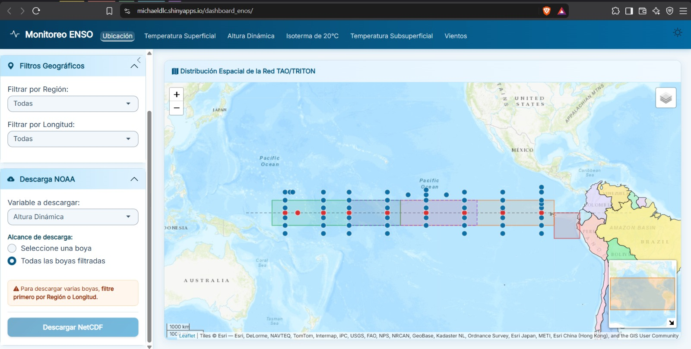

# 🌊 Monitoreo ENOS — Boyas TAO/TRITON

Dashboard interactivo desarrollado en **R Shiny** para el monitoreo del ENOS (El Niño-Oscilación del Sur) a partir de los datos en tiempo casi-real de la red de boyas **TAO/TRITON** del Pacífico ecuatorial.

## 🚀 Ver en vivo

👉 **https://michaeldlc.shinyapps.io/dashboard_enos/**

No requiere instalación. Se abre directamente en cualquier navegador.

## ✨ Características

- 🗺️ **Mapa interactivo** con la ubicación de todas las boyas TAO/TRITON y filtros por región (Niño 1+2, Niño 3, Niño 3.4, Niño 4).
- 📈 **Series temporales** de 24 meses comparando dos períodos:
  - Temperatura Superficial del Mar (TSM)
  - Altura Dinámica
  - Isoterma de 20 °C
  - Temperatura Subsuperficial (contornos profundidad-tiempo)
  - Vientos Zonales
- 🎨 **Personalización total**: 5 colores por gráfica + 5 temas ggplot.
- 📥 **Descarga de gráficas** en PNG a 300 DPI (calidad imprenta).
- ☁️ **Descarga masiva de NetCDF** directamente desde el servidor público de NOAA.
- 📊 **Climatología 1991-2020** calculada automáticamente para el cálculo de anomalías.
- 🌗 **Modo claro / oscuro** integrado.

## 📸 Captura



## 🛠️ Requisitos

- **R** ≥ 4.3
- Paquetes de R:

```r
install.packages(c(
  "shiny", "bslib", "leaflet", "sf", "rnaturalearth",
  "zip", "bsicons", "ncdf4", "curl", "lubridate",
  "dplyr", "ggplot2", "metR", "MBA",
  "shinycssloaders", "colourpicker", "rsconnect"
))
```

## 💻 Uso local 
1. Clona el repositorio:
git clone https://github.com/MaicolDLC/Monitoreo_ENOS.git
cd Monitoreo_ENOS

3. Abre RStudio en esa carpeta y ejecuta:
shiny::runApp()

5. Se abrirá en http://127.0.0.1:XXXX
## 📂 Estructura del proyecto
Monitoreo_ENOS/
├── app.R          # App principal (UI + Server)
├── estilo.R       # Tema bslib, paleta de colores, CSS
├── graficas.R     # Procesamiento NetCDF y funciones de gráficas
├── README.md
└── LICENSE

## 📖 Fuente de datos
Los datos se descargan en tiempo real desde el servidor público del Pacific Marine Environmental Laboratory (PMEL) de la NOAA:

https://www.pmel.noaa.gov/tao/taoweb/disdel_data/cdf/sites/daily/

## 👤 Autor
Michael DLC — @MaicolDLC
contacto: michael.dlc.lr@gmail.com | 20180176@lamolina.edu.pe 
